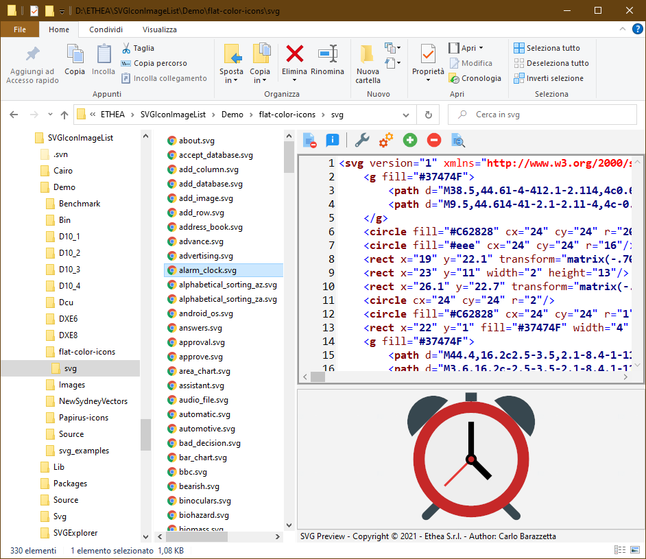
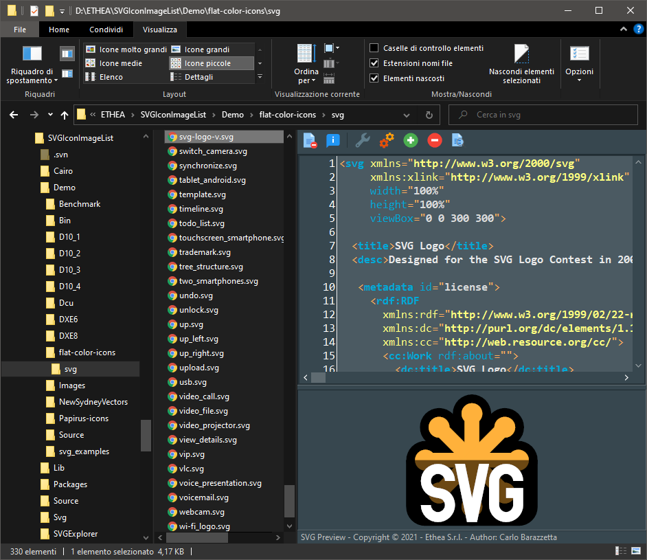

# SVG Shell Extensions 

**A collection of extensions tools for SVG files, integrated into Microsoft Windows Explorer (Vista, 7, 8 and 10):

- a [Preview handler](http://msdn.microsoft.com/en-us/magazine/cc163487.aspx)  which allows you to see the SVG image without open it, in the "Preview Panel".
 
- (WORKING) [Thumbnail handler](https://docs.microsoft.com/en-us/windows/win32/shell/thumbnail-providers) which allows you to see the SVG image without open it, into Explorer.

- (TODO) an SVG-XML Text Editor to manually edit and preview the text of SVG files.

### Features ###
* Supports Windows Vista, 7, 8 and 10 on 32 and 64 bits.
* Themes (Dark and Light) according to user preferences of Windows Theme

### Preview Panel ###

In Windows 10 with Light theme:

In Windows 10 with Dark theme:

### Thumbnails ###

In Windows 10 with Light theme:

In Windows 10 with Dark theme:

### Important Note about installing a new version ###

The work is in progress...

In order to avoid problems you must follow these steps when you install or register a new 
version of SVG Shell Extensions.

  1. Close all the windows explorer instances which have the preview handler active or the
     preview handler was used (remember the dll remains in memory until the windows explorer 
     was closed).
  2. Unregister the previous version executing the uninstaller located in 
     `C:\Program Files (x86)\Ethea\SVGShellExtensions` or 
     `C:\Program Files\Ethea\SVGShellExtensions`
  3. If you install the SVG Shell Extensions manually you must unregister using the `UnRegister.bat`
     running as admin.
  4. Now proceed with the installation of the new version.

## Release Notes ##

31 Jan 2021
- Added SVG file Preview panel
08 Feb 2021
- Added SVG Thumbnail Provider
