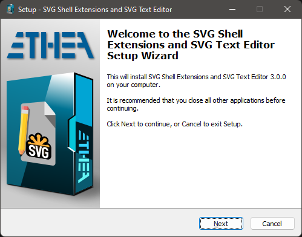

# SVG Shell Extensions 

**Latest Version 1.2.2 - 5 Mar 2021**

**A collection of extensions tools for SVG files, integrated into Microsoft Windows Explorer (Vista, 7, 8 and 10):**

- A [Preview handler][1]  which allows you to see the SVG image and text without open it, in the "Preview Panel".
 
- A [Thumbnail handler][2] which allows you to see the SVG image into Windows Explorer.

- An [SVG-XML Text Editor][10] to manually edit and preview the text of SVG files.

### Features
- Supports Windows Vista, 7, 8 and 10 (for 32 bits and 64 bits).

- Themes (Dark and Light) according to user preferences of Windows Theme

- Integrated also with other Shell Applications (like XYplorer)

### Preview Panel and Thumbnails in action ###

In Windows 10 with Light theme:

In Windows 10 with Dark theme:

### SVG Text Editor

A useful Text editor with preview of SVG Image:

### Setup using the Installer

Click to download the [SVGShellExtensionsSetup.exe][3] located also in the Release area. The Installer works both for 32 and 64 bit system.

WARNING: currently the installer is not signed with a certificate: beware of blocking by Windows or antivirus.

***For a clean Setup close all the windows explorer instances which have the preview handler active or the preview handler was used (remember the dll remains in memory until the windows explorer was closed).***

### New 32 Bit Support for XYplorer ###

As requested by many users of popular shell alternative, the new version supports XYplorer for Thumbnails and Preview Panel: follow the [configuration guide...](https://github.com/EtheaDev/SVGShellExtensions/wiki/XYplorer-Support)

### Manual Build and Installation (for Delphi developers) ###

If you have Delphi 10.4 Sydney, you can manually build the project:

***Warning: To build the DLL you need also other open-source projects***

- [SVGIconImageList][4]

- [Synedit][5]

- [VCL-Style-Utils][6]

To manually install the SVGShellExtensions.dll follow these steps:

1. Close all the windows explorer instances which have the preview handler active or the preview handler was used (remember the dll remains in memory until the windows explorer was closed).
  
2. If you have already used the installer uninstall the components from system.
     
3. To install manually the dll run the `Setup\Register64bit.bat` (run-as-administrator).

4. If you wanto to uninstall the dll you use the `Setup\UnRegister64Bit.bat`

5. When it's registered, you can continue to change code and rebuild the dll (beware to close all Explorer instances).

## Release Notes ##

05 Mar 2021
- Fixed SVG XML Editor preview after loading file
- Added support for storing/remember Editor options
- Some minor fixes

28 Feb 2021
- Fixed Context-Menu

27 Feb 2021
- Added 32 bit support
- Fixed some issue into SVG Text Editor

22 Feb 2021
- Added SVG Text Editor
- Added new Settings dialog
- Added Context-menu to open Editor and export to PNG
- Added Direct2D Engine for Preview Panel

09 Feb 2021
- Added Setup asset
- Fixed check for active Windows Theme
- Released v.1.0.0
- Released v.1.0.1

08 Feb 2021
- Added SVG Thumbnail Provider

31 Jan 2021
- Added SVG file Preview panel

## Credits

Many thanks to **Rodrigo Ruz V.** (author of [theroadtodelphi.com][7] Blog) for his wonderful work on [delphi-preview-handler][8] from which this project has used a lot of code and inspiration.

## License

Licensed under the [Apache License, Version 2.0][9] (the "License");
Unless required by applicable law or agreed to in writing, software distributed under the License is distributed on an "AS IS" BASIS, WITHOUT WARRANTIES OR CONDITIONS OF ANY KIND, either express or implied. See the License for the specific language governing permissions and limitations under the License.

Third Party libraries and tools used from Ethea:

- [SVGIconImageList][4]

The Initial Developer of the [Original Code][8] is **Rodrigo Ruz V**. Portions created by him are Copyright © 2011-2021 Rodrigo Ruz V.

Third Party libraries and tools used:

- [VCLStyles Utils][6]

- [SynEdit][5]

- [TSVG Library][10]

Related links: [embarcadero.com][11] - [learndelphi.org][12]

[1]: https://docs.microsoft.com/en-us/windows/win32/shell/preview-handlers
[2]: https://docs.microsoft.com/en-us/windows/win32/shell/thumbnail-providers
[3]: https://github.com/EtheaDev/SVGShellExtensions/releases/latest/download/SVGShellExtensionsSetup.exe
[4]: https://github.com/EtheaDev/SVGIconImageList
[5]: https://github.com/SynEdit/SynEdit
[6]: https://github.com/RRUZ/vcl-styles-utils
[7]: https://theroadtodelphi.com/
[8]: https://github.com/RRUZ/delphi-preview-handler
[9]: https://opensource.org/licenses/Apache-2.0
[10]: https://github.com/EtheaDev/SVGShellExtensions/wiki/Using-The-SVG-Text-Editor
[10]: http://www.mwcs.de
[11]: https://www.embarcadero.com/
[12]: https://learndelphi.org/
