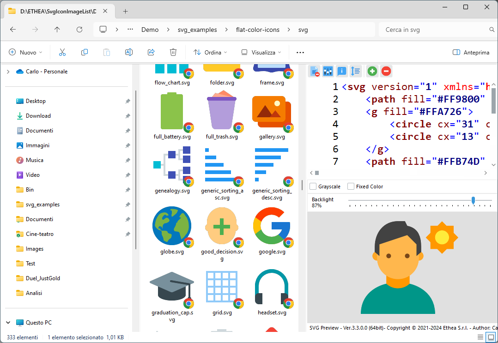

# SVG Shell Extensions 

**A collection of extensions tools for SVG files, integrated into Microsoft Windows Explorer (Vista, 7, 8 and 10):**

- a [Preview handler](http://msdn.microsoft.com/en-us/magazine/cc163487.aspx)  which allows you to see the SVG image without open it, in the "Preview Panel".
 
- a [Thumbnail handler](https://docs.microsoft.com/en-us/windows/win32/shell/thumbnail-providers) which allows you to see the SVG image into Windows Explorer.

- an SVG-XML Text Editor to manually edit and preview the text of SVG files.

### Features ###
* Supports Windows Vista, 7, 8 and 10 (only for 64 bits).

* Themes (Dark and Light) according to user preferences of Windows Theme

### Preview Panel and Thumbnails in action ###

In Windows 10 with Light theme:

In Windows 10 with Dark theme:

### Setup using the Installer ###

Click to download the [SVGShellExtensionsSetup.exe](https://github.com/EtheaDev/SVGShellExtensions/releases/download/v1.0.1/SVGShellExtensionsSetup.exe) located also in the Release area. The Installer works only on a 64 bit system.

WARNING: currently the installer is not signed with a certificate: beware of blocking by Windows or antivirus.

Look at this short video (1'47'') how to download, setup and use it:

***For a clean Setup close all the windows explorer instances which have the preview handler active or the preview handler was used (remember the dll remains in memory until the windows explorer was closed).***

### Manual Build and Installation (for Delphi developers) ###

If you have Delphi 10.4 Sydney, you can manually build the project:

***Warning: To build the DLL you need also other open-source projects***

- [SVGIconImageList](https://github.com/EtheaDev/SVGIconImageList)

- [Synedit](https://github.com/SynEdit/SynEdit)

- [VCL-Style-Utils](https://github.com/RRUZ/vcl-styles-utils)

To manually install the SVGShellExtensions.dll follow these steps:

1. Close all the windows explorer instances which have the preview handler active or the preview handler was used (remember the dll remains in memory until the windows explorer was closed).
  
2. If you have already used the installer uninstall the components from system.
     
3. To install manually the dll run the `Setup\Register64bit.bat` (run-as-administrator).

4. If you wanto to uninstall the dll you use the `Setup\UnRegister64Bit.bat`

5. When it's registered, you can continue to change code and rebuild the dll (beware to close all Explorer instances).

## Release Notes ##

09 Feb 2021
- Added Setup asset
- Fixed check for active Windows Theme
- Released v.1.0.0
- Released v.1.0.1

08 Feb 2021
- Added SVG Thumbnail Provider

31 Jan 2021
- Added SVG file Preview panel

## Credits ##

Many thanks to **Rodrigo Ruz V.** (author of https://theroadtodelphi.com/ Blog) for his wonderful work on **delphi-preview-handler** https://github.com/RRUZ/delphi-preview-handler from which this project has used a lot of code and inspiration.

## License ##

Licensed under the Apache License, Version 2.0 (the "License") https://opensource.org/licenses/Apache-2.0;
Unless required by applicable law or agreed to in writing, software distributed under the License is distributed on an "AS IS" BASIS, WITHOUT WARRANTIES OR CONDITIONS OF ANY KIND, either express or implied. See the License for the specific language governing permissions and limitations under the License.

Third Party libraries and tools used from Ethea:

- SVGIconImageList https://github.com/EtheaDev/SVGIconImageList/

The Initial Developer of the Original Code is Rodrigo Ruz V. Portions created by Rodrigo Ruz V. are Copyright © 2011-2021 Rodrigo Ruz V.

https://github.com/RRUZ/delphi-preview-handler

Third Party libraries and tools used:

- VCLStyles Utils https://github.com/RRUZ/vcl-styles-utils

- SynEdit https://github.com/SynEdit/SynEdit

- TSVG Library - http://www.mwcs.de

Related links: https://www.embarcadero.com/ - https://learndelphi.org/
