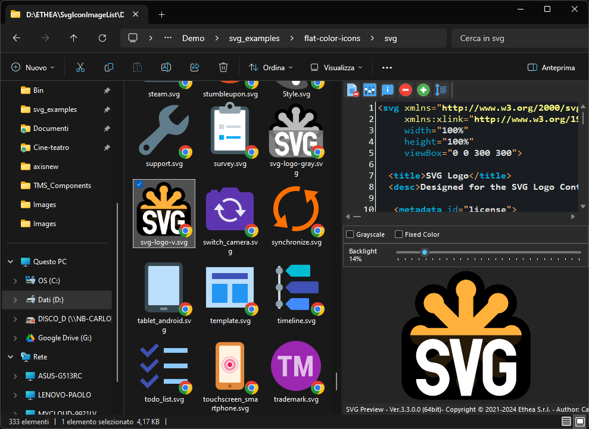

# SVG Shell Extensions 

**A collection of extensions tools for SVG files, integrated into Microsoft Windows Explorer (Vista, 7, 8 and 10):

- a [Preview handler](http://msdn.microsoft.com/en-us/magazine/cc163487.aspx)  which allows you to see the SVG image without open it, in the "Preview Panel".
 
- (WORKING) [Thumbnail handler](https://docs.microsoft.com/en-us/windows/win32/shell/thumbnail-providers) which allows you to see the SVG image without open it, into Explorer.

- (TODO) an SVG-XML Text Editor to manually edit and preview the text of SVG files.

### Features ###
* Supports Windows Vista, 7, 8 and 10 on 32 and 64 bits.
* Themes (Dark and Light) according to user preferences of Windows Theme

### Preview Panel and Thumbnails in action ###

In Windows 10 with Light theme:

In Windows 10 with Dark theme:

### Setup ###

If you have Delphi 10.4 Sydney, you can manually build the project and install the SVGShellExtensions.dll following these steps:

  1. Close all the windows explorer instances which have the preview handler active or the
     preview handler was used (remember the dll remains in memory until the windows explorer 
     was closed).
  2. Unregister the previous version executing the uninstaller located in 
     `C:\Program Files\Ethea\SVGShellExtensions`
  3. If you install the SVG Shell Extensions manually you must unregister using the `UnRegister64Bit.bat`
     running as admin.
  4. Now proceed with the installation of the new version.

## Release Notes ##

31 Jan 2021
- Added SVG file Preview panel
08 Feb 2021
- Added SVG Thumbnail Provider

## Credits ##

Many thanks to **Rodrigo Ruz V.** (author of https://theroadtodelphi.com/ Blog) for his wonderful work on **delphi-preview-handler** https://github.com/RRUZ/delphi-preview-handler from which this project has used a lot of code and inspiration.

## License ##

Licensed under the Apache License, Version 2.0 (the "License") https://opensource.org/licenses/Apache-2.0;
Unless required by applicable law or agreed to in writing, software distributed under the License is distributed on an "AS IS" BASIS, WITHOUT WARRANTIES OR CONDITIONS OF ANY KIND, either express or implied. See the License for the specific language governing permissions and limitations under the License.

Third Party libraries and tools used from Ethea:

- SVGIconImageList https://github.com/EtheaDev/SVGIconImageList/

The Initial Developer of the Original Code is Rodrigo Ruz V. Portions created by Rodrigo Ruz V. are Copyright © 2011-2021 Rodrigo Ruz V.

https://github.com/RRUZ/delphi-preview-handler

Third Party libraries and tools used:

- VCLStyles Utils https://github.com/RRUZ/vcl-styles-utils

- SynEdit https://github.com/SynEdit/SynEdit

- TSVG Library - http://www.mwcs.de
